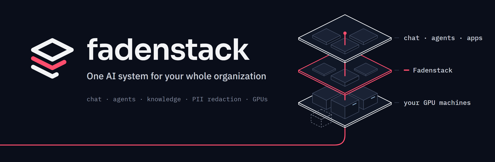
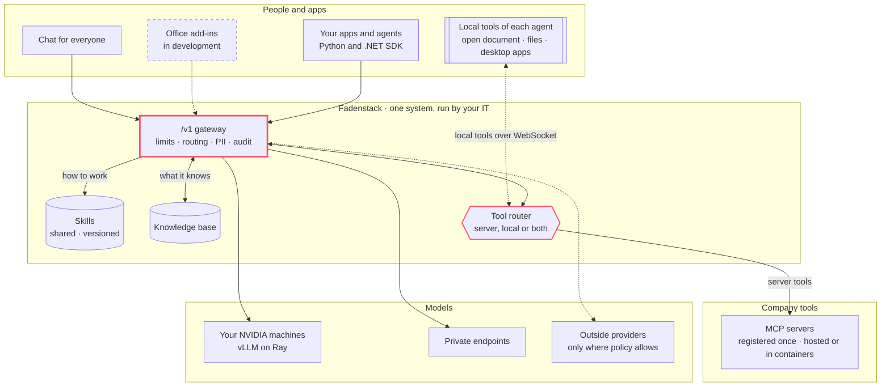

<!--
  Organisation profile README (github.com/fadenstack/.github, profile/README.md).
  Until the repos move from the llm-port org, links point there; GitHub redirects them
  after the transfer. Then switch them to github.com/fadenstack/... and restore the
  Guide and Website links below. Banner source: brand/github-profile/banner.html.
-->

<p align="center">
  <picture>
    <source media="(prefers-color-scheme: dark)" srcset="./banner-dark.png">
    <source media="(prefers-color-scheme: light)" srcset="./banner-light.png">
    
  </picture>
</p>

<h3 align="center">One AI system for your whole organization.</h3>

<p align="center">
  Chat for everyone, agents in the tools your people already use, an SDK for your developers,<br>
  and the models on your own GPUs. Your IT department runs it all as one system.
</p>

<p align="center">
  <a href="#quick-start"><b>Quick start</b></a> ·
  <a href="https://github.com/llm-port/llm-port-core">Core repo</a> ·
  <a href="https://emagin8.de/contact?subject=Fadenstack">Contact</a>
  <!-- Once live:
  · <a href="https://fadenstack.com/docs/">Guide</a>
  · <a href="https://fadenstack.com">Website</a>
  · <a href="https://demo.fadenstack.com">Live demo</a> -->
</p>

<p align="center">
  
  
  
  
</p>

---

Large companies have whole departments building their AI platform. One team runs the GPUs, another the gateway, another the chat, and yet another decides which data may go where. Most organizations don't have those departments.

**Fadenstack gives your IT team all of it as one system,** installed on your own servers and run from one console.

## What each part of your organization gets

**Everyone: a chat assistant on your own models.**
It works like ChatGPT, with your documents, your team's shared skills and the tools IT has connected. It speaks English, Deutsch, Español and 中文.

**Developers: one endpoint and an SDK for agents.**
An OpenAI-compatible `/v1`, plus SDKs for Python and .NET that add sessions, memory, tools and attachments to the OpenAI SDKs. Through that one endpoint, every agent gets the organization's skills, knowledge and tools, and it can bring tools of its own that run on the user's machine. It follows the same rules as the chat.

**IT: one console for all of it.**
Users and roles, models and GPU machines, skills, MCP servers, PII rules, usage per team, traces and the audit log.

**Data protection: rules that hold everywhere.**
Personal data is redacted before any model sees it, and every answer records where it was computed.

## One system instead of many

|  | What organizations usually end up with | With Fadenstack |
|---|---|---|
| **Chat** | Chatbot accounts, bought team by team | One chat for everyone, on models you choose |
| **Apps and agents** | Every project wires up its own API keys | One endpoint and one SDK, with the same rules for all |
| **Know-how** | Prompts copied between documents and chats | Shared, versioned skills, with a record of which one was used |
| **Agent tools** | Every agent wired to every system on its own | MCP servers registered once, used by every agent that's allowed to |
| **Personal data** | A policy document, and hope | Redacted before any model sees it |
| **Models and GPUs** | A GPU server someone set up once | Machines, clusters and models, run from the console |
| **Oversight** | Separate bills and no audit trail | Usage, cost and audit per request, in one place |

## Skills, knowledge and tools, managed once

Every chat and every agent draws on the same three things, and IT manages each of them in one place.

- **Skills: how to work.** Your team's checklists, formats and procedures, kept as versioned instructions. Share a skill with people, groups or the whole organization. Publish a new version and every chat and agent gets it. The audit log records which version each answer used.
- **Knowledge: what it knows.** Your documents, searched by the model itself, with the source named.
- **Tools: what it can do.** MCP servers are registered once on the server: hosted ones such as GitHub's, or your own in containers. Every agent that is allowed can call them. Agents can also bring local tools, like the open Word document or files on the user's machine, which run on the user's side. Each session's policy decides where tools run: on the server, locally, or both.

## Coming next: agents in Office

Assistants for Word, Excel and Outlook, built on the Fadenstack .NET SDK. They get the organization's skills, knowledge and MCP tools, add local tools for the document you have open, and follow the same PII rules and audit trail as the chat. *In development.*

## Quick start

On a Linux server (x86_64) with Docker. The server needs no GPU of its own.

```bash
pipx install llmport-cli   # the CLI keeps its old name until the rename reaches PyPI
llmport deploy
```

<!-- After the rename ships:  pipx install fadenstack  /  faden deploy -->

Open `http://<server>` and sign in. Add your GPU machines under **Machines → Add a machine** and deploy a model from the **model marketplace**. Your people can start chatting, and your apps can use any OpenAI client:

```python
from openai import OpenAI

client = OpenAI(base_url="http://<server>/v1", api_key="<your key>")
reply = client.chat.completions.create(
    model="qwen-chat",
    messages=[{"role": "user", "content": "Hello from Fadenstack"}],
)
```

Already running vLLM? Fadenstack finds the containers on your machines and puts them behind the gateway without restarting them.

## How it fits together



## Repositories

| Repository | What it is |
|---|---|
| **[fadenstack](https://github.com/llm-port/llm-port-core)** | The platform: gateway, chat, console and control plane, PII service, MCP and skills registries, CLI and node agent. |
| **[mcp-server-brave](https://github.com/llm-port/mcp-server-brave)** | Brave Search as MCP tools, for web and local search. |
| **[mcp-server-searxng](https://github.com/llm-port/mcp-server-searxng)** | Web search through your own SearXNG, with SearXNG and the MCP server in one container. |
| **[mcp-server-webscraper](https://github.com/llm-port/mcp-server-webscraper)** | Turns web pages into compact, model-ready text or Markdown. |

The repositories are moving over from the [llm-port](https://github.com/llm-port) organization, where the core is still called `llm-port-core`. Until then, the links open them there.

<!--
  Add these rows as each repository becomes public:
| **fadenstack-sdk-python** · **fadenstack-sdk-dotnet** | SDKs for apps and agents: the OpenAI SDKs plus sessions, memory, tools and attachments. |
| **fadenstack-office** | Agents for Word, Excel and Outlook, built on the .NET SDK. |
| **fadenstack-rag** | The retrieval engine: vector, keyword and hybrid search over your documents and file servers. |
| **fadenstack-docling** | Rich document extraction (tables, images, pages) feeding the knowledge base. |
| **fadenstack-auth** · **fadenstack-mailer** | Single sign-on and mail delivery services. |
-->

## Why the name

<picture><source media="(prefers-color-scheme: dark)" srcset="./mark-dark.svg"></picture>
&nbsp;→&nbsp;
<picture><source media="(prefers-color-scheme: dark)" srcset="./f-dark.svg"></picture>

In German, *der rote Faden* (the red thread) is the guiding idea that runs through something and holds it together as a whole.

The expression goes back to Goethe's *Die Wahlverwandtschaften* (*Elective Affinities*, 1809). Goethe describes a red thread woven through every rope of the English Royal Navy. It could not be pulled out without unravelling the rope, and even a small piece could still be recognized as belonging to the Crown. He used the image for a thread that connects the whole and gives it coherence.

**Fadenstack** is that thread through your organization's AI. Chat assistants, agents, data, models, tools and infrastructure are connected once, governed in one place, and traceable end to end.

**Every model. Every source. One thread.**

## Community and Enterprise

The core is open source under **Apache 2.0**. Enterprise adds what regulated teams ask for, on the same platform: single sign-on, advanced PII tokenisation, governance and support with an SLA. [Get in touch →](https://emagin8.de/contact?subject=Fadenstack)

Issues, ideas and pull requests are welcome in each repository.

Fadenstack runs several upstream open-source services in their own containers, and each keeps its own licence. See [THIRD_PARTY_NOTICES.md](./THIRD_PARTY_NOTICES.md).

---

<p align="center"><sub>Built in Germany by <a href="https://emagin8.de">Emagin8</a> · English · Deutsch · Español · 中文</sub></p>
